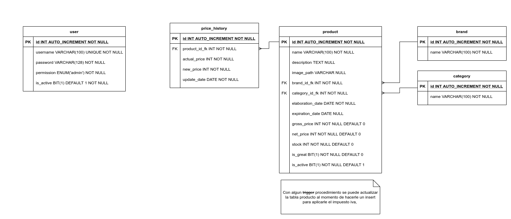

# SistemaUltraOp 

## Descripción
Sistema encargado principalmente en la asistencia del **stock de los productos**, 
ya sea de una tienda comercial, Supermercado, Minimarket, etc. 

## Integrantes
- **Gastón Hernán Cathalifaud Rosales**
    - Frontend Developer
- **Santiago Ignacio Fierro Madrid**
    - Backend Developer

## Modelo Entidad-Relación

## Entidades

### user

| **Columna** | Tipo | **Descripción** |
|-------------|------|-----------------|
| **id** | INT |Identificador unico del usuario |
| **username** | VARCHAR(100) | Nombre con el cual el usuario va a poder ingresar al sistema |
| **password** | VARCHAR(128) | Contraseña personal que solamente va a conocer el usuario. Esta contraseña va a estar cifrada mediante el protocolo SHA2 en su variedad 512 [SHA2('Contraseña', 512)] |
| **permission** | ENUM('admin') | Permisos que puede tener el usuario, por ahora, basicamente el **admin** solamente puede ingresar al sistema, pero ahí está el campo por si se necesita agregar otro cargo |
| **is_active** | BIT | Campo que verifica si el usuario está en la empresa o no, básicamente, si el usuario es desvinculado de la empresa, solamente hay que cambiar este dato a falso, conservandolo en la base de datos por si en alguna ocasion volviese a la empresa, evitando volver a crear un perfil para este |